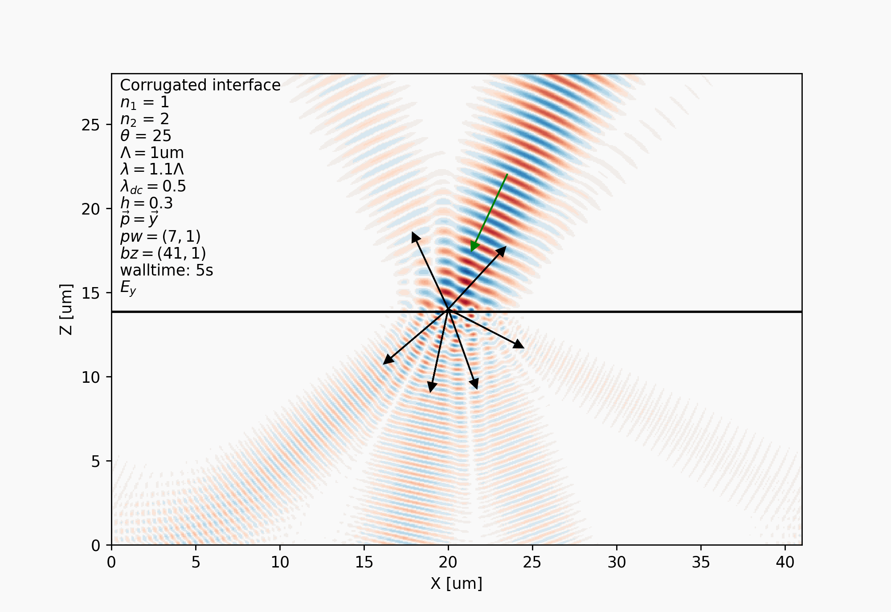
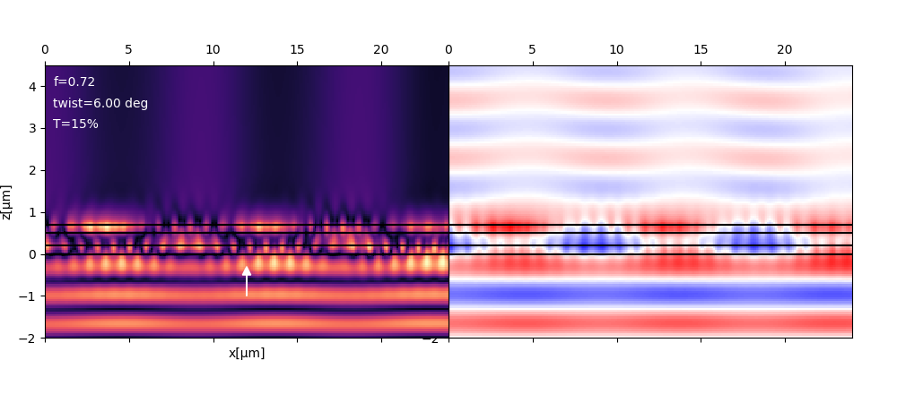
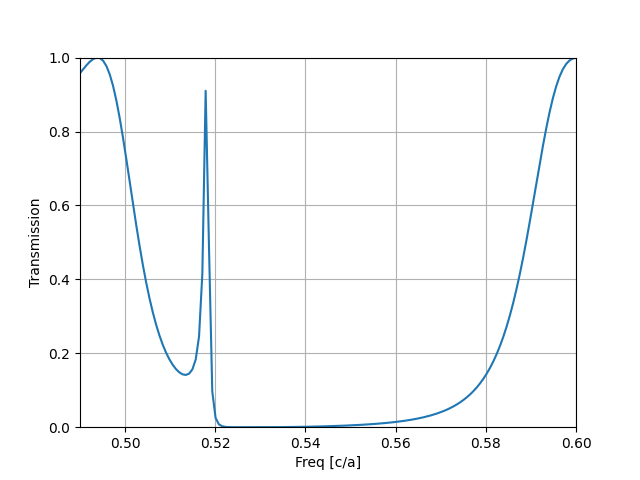
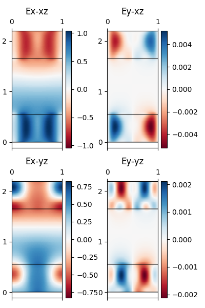
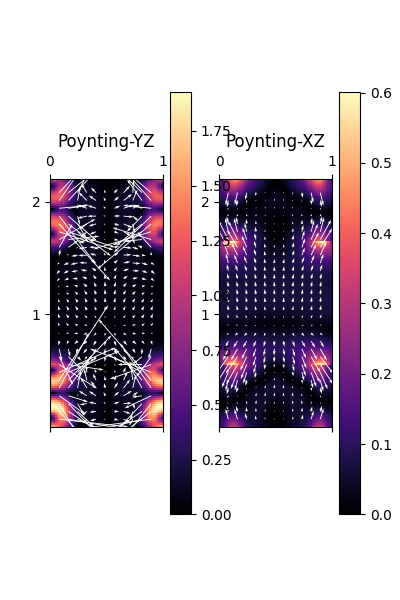

# Khepri: Kode for High-Efficiency Propagation of Radiant Interactions

Scientific validation cases are reusable physical experiments shared by
tests, examples, sequential/threaded runners, and machine-readable reports.
See [the validation design](doc/scientific-validation.md).


## Installation

```bash
pip install 'khepri @ git+https://github.com/Kaeryv/Khepri'
```
If you are using [uv](https://github.com/astral-sh/uv) in a new _project_name_ folder:
```bash
uv init <project_name>
uv add 'khepri @ git+https://github.com/Kaeryv/Khepri'
```

For a uv-managed virtual environment without creating a project dependency:

```bash
uv pip install 'khepri @ git+https://github.com/Kaeryv/Khepri'
```

Khepri uses standard PEP 517/621 metadata in `pyproject.toml`, so local and
editable installs use the same build path:

```bash
python -m pip install .
python -m pip install -e .
uv pip install .
```


[](https://github.com/Kaeryv/Bast/actions/workflows/python-package.yml)

RCWA Implementation fully in python!
- Two implementations are available
- Easy-to-use script with json input files available in exebutable module `khepri.ez`

## Brillouin zone integration of fields



## Extended RCWA

The code enables the use of extended RCWA, allowing for twisted bilayer systems.

For source-specific R/T/A calculations, select the memory-efficient backend
with `Crystal.solve(backend="operator")`. It works with ordinary and twisted
stacks while avoiding dense partial and total stack matrices. Historical
`Crystal.solve()` behavior remains dense; `backend="auto"` opts into the
operator path for compatible twisted stacks when no internal fields are marked.

The operator result supports total and per-diffraction-order R/T. It does not
pretend to contain the complete S matrix or internal fields: accessing
`Crystal.S`, `Crystal.Stot`, or requesting fields raises
`OperatorCapabilityError` with instructions to re-run using `backend="dense"`.




## Getting started

Here is a sample code to get you started, don't hesitate to contact me on Github if you need help (via issues for example).

```python
from khepri.crystal import Crystal
from khepri.draw import Drawing
import matplotlib.pyplot as plt
import numpy as np

d = Drawing((128,)*2, 12, None)
d.disc((0.0, 0.0), 0.4, 1.0)

cl = Crystal((5,5))
cl.add_layer_uniform("S1", 1, 1.1)
cl.add_layer_pixmap("Scyl", d.canvas(), 0.55)
stacking = ["Scyl", "S1", "Scyl"]
cl.set_device(stacking, [True]*len(stacking))
chart = list()
freqs = np.linspace(0.49, 0.6, 151)
for f in freqs:
    wl = 1 / f
    cl.set_source(1 / f, 1.0, 0, 0.0, 0.0)
    cl.solve()
    chart.append(cl.poynting_flux_end())
fig, ax = plt.subplots()
ax.plot(freqs, np.asarray(chart)[:, 1])
ax.set_xlim(np.min(freqs), np.max(freqs))
ax.set_ylim(0, 1)
ax.set_xlabel("Freq [c/a]")
ax.set_ylabel("Transmission")
ax.grid("both")
plt.savefig("examples/figures/suh03.png")
plt.show()
```



## Field maps

`set_device(..., fields_mask=...)` controls internal-field retention. Its
default is `False`, which keeps R/T/A unchanged while avoiding unused forward
and reverse partial stacks. Set the corresponding device-layer entries to
`True` before solving if fields will be sampled there. A later request in a
disabled device layer emits `FieldsNotRetainedWarning` and returns the typed
`FieldsNotRetained` value instead of allocating the missing stacks after the
fact.

### Electro-magnetic field for the above structure

```python
x, y, z = coords(0, 1, 0.0, 1.0, 0.0001, cl.depth, (xyres, xyres, zres))
zvals = tqdm(z) if progress else z # progress bar on depth
E, H = cl.fields_volume(x, y, z)
```



### Poynting vector for the above structure



## Testing

Some integration tests can be ran with

```bash
python -m unittest discover test
```
