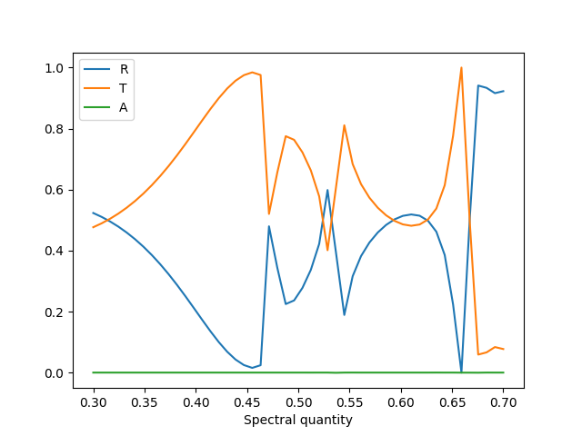

# Bast

RCWA Implementation fully in python!
- Two implementations are available
- Easy-to-use script with json input files available in exebutable module `bast.ez`


## Getting started

Here is a sample code to get tou started, don't hesitate to contact me on Github if you need help (via issues for example).

```python
a = 800e-9      # m
r = 0.25 * a    # m
d = 0.20 * a    # m
epsr_layer = 9.0
plane_waves = (5,5)

import sys
sys.path.append(".")

import numpy as np
from bast.lattice import CartesianLattice
from bast.tools import c, compute_fluxes, incident
from bast.scattering import scattering_matrix
from tqdm import tqdm
# The lattice has air/void incidence and an air subtrate, the lattice is square.
l = CartesianLattice(plane_waves, (a, 0), (0, a), 1.0, 1.0)

# We study some wavelengths.
freqs = np.linspace(0.3, 0.7, 50)

# Create an incident wave at normal incidence
k_planar = (0.0,0.0)
pin = incident(plane_waves, p_pol=1.0, s_pol=0.0)

RTA = list()
for i, frequency in enumerate(tqdm(freqs)):
    freq = frequency * c / a # Hz
    wavelength = c / freq
    # A dielectric layer with an air hole of radius r
    S = scattering_matrix(plane_waves, l, "disc", [0.0, 0.0, r], 1.0, epsr_layer, wavelength, kp=k_planar, depth=0.4*a)
    RTA.append(compute_fluxes(l, wavelength, pin, S @ pin, kp=k_planar))

RTA = np.asarray(RTA)
import matplotlib.pyplot as plt
fig, ax = plt.subplots()
labels = iter(["R", "T", "A"])
for sq in RTA.T:
    ax.plot(freqs, sq, label=next(labels))
ax.set_xlabel("Frequency [c/a]")
ax.set_xlabel("Spectral quantity")
plt.legend()
fig.savefig("holey_slab.png")
```

