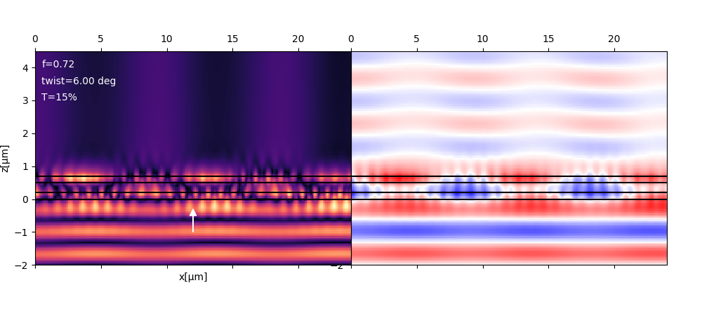
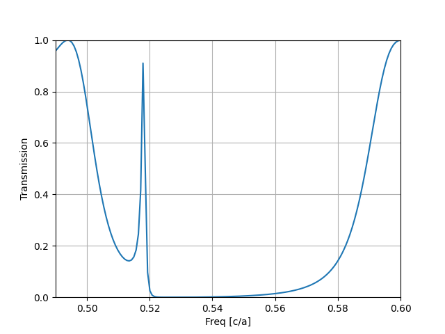
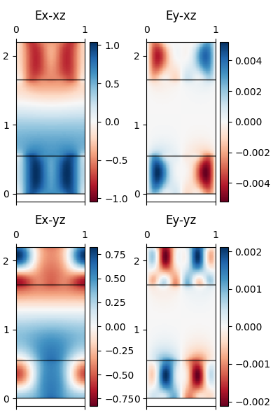
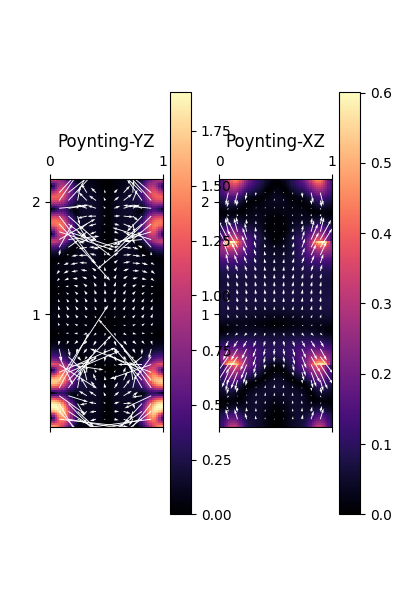

# Bast

## Installation

```bash
pip install 'bast @ git+https://github.com/Kaeryv/Bast'
```


[](https://github.com/Kaeryv/Bast/actions/workflows/python-package.yml)

RCWA Implementation fully in python!
- Two implementations are available
- Easy-to-use script with json input files available in exebutable module `bast.ez`


## Extended RCWA

The code enables the use of extended RCWA, allowing for twisted bilayer systems.




## Getting started

Here is a sample code to get tou started, don't hesitate to contact me on Github if you need help (via issues for example).

```python
from bast.crystal import Crystal
from bast.draw import Drawing
import matplotlib.pyplot as plt
import numpy as np

d = Drawing((128,)*2, 12, None)
d.circle((0.0, 0.0), 0.4, 1.0)

cl = Crystal((5,5))
cl.add_layer_uniform("S1", 1, 1.1)
cl.add_layer_pixmap("Scyl", d.canvas(), 0.55)
stacking = ["Scyl", "S1", "Scyl"]
cl.set_device(stacking, [True]*len(stacking))
chart = list()
freqs = np.linspace(0.49, 0.6, 151)
for f in freqs:
    wl = 1 / f
    cl.set_source(1 / f, 1.0, 0, 0.0, 0.0)
    cl.solve()
    chart.append(cl.poynting_flux_end())
fig, ax = plt.subplots()
ax.plot(freqs, np.asarray(chart)[:, 1])
ax.set_xlim(np.min(freqs), np.max(freqs))
ax.set_ylim(0, 1)
ax.set_xlabel("Freq [c/a]")
ax.set_ylabel("Transmission")
ax.grid("both")
plt.savefig("examples/figures/suh03.png")
plt.show()
```



## Field maps

### Electro-magnetic field for the above structure



### Poynting vector for the above structure



## Testing

Some integration tests can be ran with

```bash
python -m unittest discover tests
```
